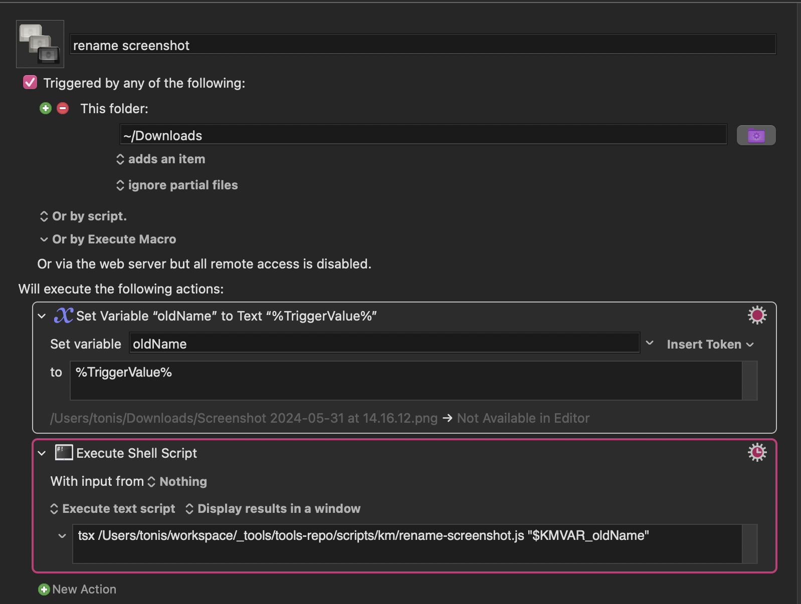

there is no return. Instead, you need to console.log and exit
```
let exit = (res) => {
  console.log(res)
  process.exit()
}
```

use with clipboard:
`tsx ~/workspace/_tools/tools-repo/scripts/km/convert-link-to-md-link.js "$(pbpaste)"`

